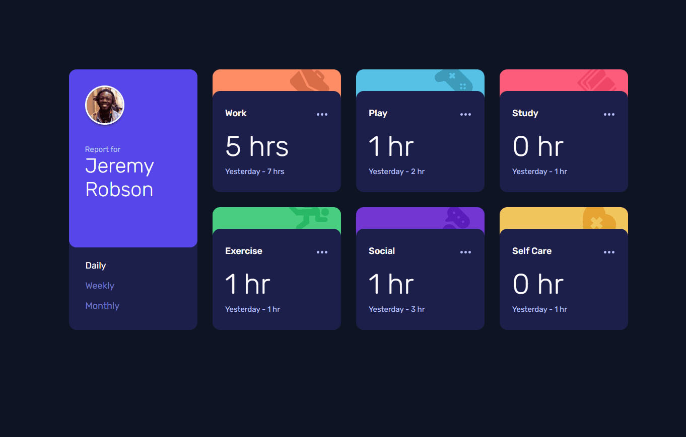

# Frontend Mentor - Time tracking dashboard solution

This is a solution to the [Time tracking dashboard challenge on Frontend Mentor](https://www.frontendmentor.io/challenges/time-tracking-dashboard-UIQ7167Jw). Frontend Mentor challenges help you improve your coding skills by building realistic projects.

## Table of contents

- [Overview](#overview)
  - [The challenge](#the-challenge)
  - [Screenshot](#screenshot)
  - [Links](#links)
- [My process](#my-process)
  - [Built with](#built-with)
  - [What I learned](#what-i-learned)
  - [Continued development](#continued-development)
  - [Useful resources](#useful-resources)
- [Author](#author)

## Overview

### The challenge

Users should be able to:

- View the optimal layout for the site depending on their device's screen size
- See hover states for all interactive elements on the page
- Switch between viewing Daily, Weekly, and Monthly stats

### Screenshot

### Links

- Live Site URL: [Time tracking dashboard / Vercel-deployment](https://fm-time-tracking-dashboard-mu.vercel.app/)

## My process

### Built with

- Semantic HTML5 markup
- CSS custom properties
- Flexbox
- CSS Grid
- Mobile-first workflow
- JavaScript

### What I learned

The content of the activity-section was retrieved from a separate data-file. This part is built up with JavaScript by using the document.createElement method and by using template literals the content of each activity is created dynamically.

### Continued development

The attached links gave me orientation and ideas for combining buttons and timframe-tabs to address accessibility issues. There is more to discover in this regard for the future.

### Useful resources

- [ARIA: tab role ](https://developer.mozilla.org/en-US/docs/Web/Accessibility/ARIA/Roles/tab_role) - This helped me with accessibility.
- [Example Tab Group](https://www.atomica11y.com/accessible-web/tabs/) - This helped me with accessibility.

## Author

- Frontend Mentor - [@MarenOelixtown](https://www.frontendmentor.io/profile/MarenOelixtown)
